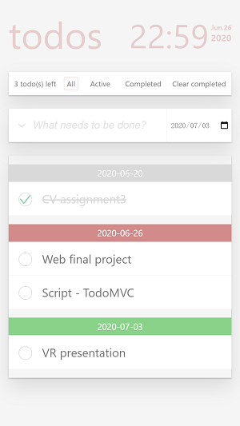

# TodoMVC

Author: 1651760 罗宇

Github：https://github.com/ly1197182168/ly1197182168.github.io

Preview: https://ly1197182168.github.io/mytodo

## 界面



## 功能

### 基本功能

- 新增 `Todo`

  用户在输入框输入 `Todo` 文本并选择截止日期，按下回车添加该条 `Todo` 并清空输入框。

- 删除 `Todo`

  点击某条 `Todo` 末端的删除按钮，删除该条 `Todo`。 

- 展现列表

  已添加的 `Todo` 在输入框下方以列表形式展现。

- 更改 `Todo` 状态

  点击 `Todo` 前端的 `CheckBox`，标记该项已完成，再次点击则取消标记。 

- 全部完成/取消

  点击输入款前端的 `Toggle` 按钮，将已添加 `Todo` 全部完成或取消。

- 删除已完成

  当列表中存在已完成项，出现 `Clear Completed` 按钮，点击该按钮并删除所有已完成项。

### 高级功能

- 菜单过滤

  菜单按 `Todo` 完成状态提供三种过滤方式：

  - `All`：显示所有已添加项；
  - `Active`：显示所有未完成项；
  - `Completed`：显示所有已完成项。

- 文本过滤

  用户在输入框输入时，显示所有包含实时输入文本的字串的项目，能够配合菜单过滤中的选项实现多条件过滤。

  ```javascript
  todoDetail.innerHTML.toUpperCase().indexOf(textFilter) > -1)；
  ```

- 编辑单条 `Todo`

  双击 `Todo`，以输入框替代当前项并自动填入待编辑文本，点击其他任意除取消编辑，编辑完成后按回车确认。

  ```javascript
  todoDetail.addEventListener('dblclick', function (){
      let edit = document.createElement('input');
      edit.setAttribute('value', todoDetail.innerHTML);
      ......
      edit..addEventListener('blur', function () {
              finish();
      });
      ......
      edit.addEventListener('keyup', function (event){
          if (event.keyCode == 13){
              update(id, item);
              finish()
          }
          ......
      });
      ......  
  });
  ```

- 按时间分块展现列表

  展现 `Todo` 列表时，根据用户选择的截至时间，按日期分块展现列表。

- 根据剩余天数改变颜色

  根据截至日期与现在的时间做差设置 `Todo` 状态：

  - `Expired`：当天以前的 `Todo`，过期项；
  - `Urgent`：`Todo` 剩余时间小于三天，紧急项；
  - `Adequate`：`Todo` 剩余时间大于等于三天，充裕项。

- 拖拽排序

  为 `Todo` 设置 `Touch` 事件监听，并根据监听到不同的 `Touch` 事件调用不同的函数：

  拖拽选定 `Todo` 项至于适当位置，根据 `Touch` 事件实时获得当前触摸位置的坐标，根据当前位置判断用户要将该 `Todo` 置于的位置：

  - `TouchStart` 时，设置空白块替被选中的 `Todo`，选中的 `Todo` 的 `position` 设置为 `absolute`；

  - `TouchMove` 时，根据 `Touch` 事件实时获得当前触摸位置的坐标设置选中项的绝对坐标，并判断其他项是否要移动：

    - 当从上往下拖拽时，若触摸位置超过该位置下对应的 `Todo` 的宽度的一半，对应项上移空白项下移；
    - 当从下往上拖拽时，若触摸位置超过该位置下对应的 `Todo` 的宽度的一半，对应项下移空白项上移；

  - `TouchEnd` 时，根据结束触摸的位置进行不同的操作：

    - 如果结束触摸位置位于选中 `Todo` 所属截至日期对应的 `TodoList`，选中项插入当前位置并删除空白项；
    - 如果结束触摸位置位于选中 `Todo` 所属截至日期之外的 `TodoList`，选中项插入当前位置并删除空白项，更新选中项截至日期为当前位置下方的 `TodoList` 对应的日期。

    ```javascript
    todoItem.addEventListener('touchstart', function (event) {
        drag = true;
        dragAlt = document.createElement('li');
        todoItem.parentElement.insertBefore(dragAlt, todoItem);
        ......
    }, false);
    
    todoItem.addEventListener('touchmove', function (event) {
        if(drag){
            todoItem.style.left = ...;
            todoItem.style.top = ...;
            ...
            if((event.touches[0].clientX > offset[0])
               && (event.touches[0].clientX < offset[0] + offset[2])
               && (event.touches[0].clientY > offset[1])
               && (event.touches[0].clientY < offset[1] + offset[3])){
                if(event.touches[0].clientY < offset[1] + offset[3] / 2){
                    ......
                }else{
                    ......
                }
            }
            ......
        }
    }, false);
    
    todoItem.addEventListener('touchend', function (event) {
        if(drag){
            ......
            drag = false;
            updateAllFromPage();
            updatePage();
        }
    }, false);
    ```

- 滑动删除

  为 `Todo` 设置 `Touch` 事件监听，`TouchEnd` 时，如果结束触摸点的 `ClientX` 位于 `todo` 项的右端20% 的范围之内，删除该项。

  ```javascript
  if (event.changedTouches[0].clientX > offset[0] + 0.8 * offset[2]){
  	......
  }
  ```
